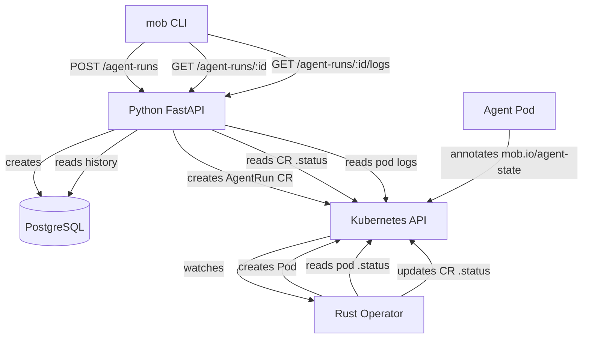

# fix: Wire the agent orchestration loop with a Kubernetes-native CRD operator

## Overview

Running `mob agent run <agent_id>` creates a database record in PENDING state and stops. No pod ever launches. The core value proposition — running AI agents as Kubernetes pods — is completely non-functional.

Instead of wiring the existing Python `K8sManager` directly into the service layer, this plan introduces a **Kubernetes-native operator** written in **Rust (kube-rs)** with a **Custom Resource Definition (CRD)** for `AgentRun`. The Python API creates CRs; the Rust controller watches them, creates pods, and syncs state via `.status`. Pod state is derived from the Kubernetes pod `.status.phase` and pod annotations.

## Problem Statement / Motivation

```
$ mob agent run 5e354f51-65c7-4d46-b1b6-2e56b1758c22
Agent run 'f19540ad-...' created (state: pending).
pod_name: None         # <-- nothing happens after this
```

**Downstream breakage:**
- `agent logs` → "No pod associated with this run yet." (always, forever)
- `agent attach` → same
- `agent stop` → sets DB state to FAILED but never deletes the K8s pod
- `agent send` → returns `{"status": "sent"}` without doing anything
- `update_agent_run_state` → accepts any state transition including FINISHED→PENDING

**Why a CRD operator instead of wiring K8sManager directly:**
- **Kubernetes-native**: The controller reconciliation loop handles restarts, crashes, and partial failures automatically — no orphaned PENDING runs
- **Separation of concerns**: Python API manages domain data (agents, orgs, skills); Rust operator manages pod lifecycle
- **State via `.status`**: Pod state flows through Kubernetes primitives (pod phase, CR status subresource) instead of HTTP callbacks
- **Performance**: Rust operator is lightweight (~32MB memory) and event-driven vs polling
- **Correctness**: Owner references ensure automatic garbage collection of pods when runs are deleted

## Proposed Solution

### Architecture

```
CLI (click) ──► Python API ──► creates AgentRun CR ──► Kubernetes API
                    │                                        │
                    │                                   Operator watches
                    │                                        │
                    │                                   Creates Pod (owned)
                    │                                   Reads pod .status.phase
                    │                                   Reads pod annotations
                    │                                   Updates CR .status
                    │                                        │
                    ◄── reads CR .status ◄───────────────────┘
```

**Key principle**: The Python API writes `.spec`, the Rust controller writes `.status`. Neither touches the other's domain.

### Phase 1: CRD + Rust Operator

#### 1.1 Define the AgentRun CRD

```rust
// operator/src/crd/agent_run.rs
#[derive(CustomResource, Serialize, Deserialize, Default, Debug, Clone, JsonSchema)]
#[kube(
    group = "mob.io",
    version = "v1",
    kind = "AgentRun",
    namespaced,
    status = "AgentRunStatus",
    shortname = "ar",
    printcolumn = r#"{"name":"State","type":"string","jsonPath":".status.state"}"#,
    printcolumn = r#"{"name":"Agent","type":"string","jsonPath":".spec.agentName"}"#,
    printcolumn = r#"{"name":"Pod","type":"string","jsonPath":".status.podName"}"#
)]
pub struct AgentRunSpec {
    pub agent_id: String,
    pub agent_name: String,
    pub agent_template: String,          // Docker image
    pub system_prompt: Option<String>,
    pub model_endpoint: Option<String>,
    pub task_id: Option<String>,
    pub skill_ids: Option<Vec<String>>,
}

#[derive(Deserialize, Serialize, Clone, Debug, Default, JsonSchema)]
pub struct AgentRunStatus {
    pub state: String,                   // Pending, Starting, Idle, Busy, Finished, Failed
    pub pod_name: Option<String>,
    pub error_message: Option<String>,
    pub last_transition_time: Option<String>,
}
```

#### 1.2 Controller Reconciliation Loop

```rust
// operator/src/controller/agent_run_controller.rs
async fn reconcile(ar: Arc<AgentRun>, ctx: Arc<Context>) -> Result<Action, Error> {
    let ns = ar.namespace().unwrap_or_default();
    let name = ar.name_any();
    let run_api: Api<AgentRun> = Api::namespaced(ctx.client.clone(), &ns);
    let pod_api: Api<Pod> = Api::namespaced(ctx.client.clone(), &ns);

    // Use finalizer for cleanup on deletion
    finalizer(&run_api, FINALIZER, ar.clone(), |event| async {
        match event {
            Event::Apply(ar) => reconcile_apply(ar, ctx.clone()).await,
            Event::Cleanup(ar) => reconcile_cleanup(ar, ctx.clone()).await,
        }
    }).await
}

async fn reconcile_apply(ar: Arc<AgentRun>, ctx: Arc<Context>) -> Result<Action, Error> {
    let state = ar.status.as_ref()
        .map(|s| s.state.as_str())
        .unwrap_or("Pending");

    match state {
        "Pending" => {
            // Create pod with owner reference (server-side apply = idempotent)
            let pod = build_agent_pod(&ar)?;
            pod_api.patch(&pod_name, &PatchParams::apply("mob-operator"), &Patch::Apply(&pod)).await?;
            update_status(&run_api, &name, "Starting", Some(&pod_name), None).await?;
        }
        "Starting" => {
            // Read pod .status.phase to determine if ready
            match pod_api.get(&pod_name).await {
                Ok(pod) => {
                    let derived = derive_state_from_pod(&pod);
                    if derived != "Starting" {
                        update_status(&run_api, &name, &derived, Some(&pod_name), None).await?;
                    }
                }
                Err(_) => {
                    update_status(&run_api, &name, "Failed", None, Some("Pod not found")).await?;
                }
            }
        }
        "Idle" | "Busy" => {
            // Check pod still exists; read annotations for fine-grained state
            match pod_api.get(&pod_name).await {
                Ok(pod) => {
                    let derived = derive_state_from_pod(&pod);
                    if derived != state {
                        update_status(&run_api, &name, &derived, Some(&pod_name), None).await?;
                    }
                }
                Err(_) => {
                    update_status(&run_api, &name, "Failed", None, Some("Pod disappeared")).await?;
                }
            }
        }
        "Finished" | "Failed" => {
            // Terminal — clean up pod, return await_change
            if let Some(pn) = ar.status.as_ref().and_then(|s| s.pod_name.as_deref()) {
                let _ = pod_api.delete(pn, &Default::default()).await;
            }
            return Ok(Action::await_change());
        }
        _ => {}
    }

    Ok(Action::requeue(Duration::from_secs(15)))
}
```

#### 1.3 Pod State Derivation

State is derived from **pod `.status.phase`** + **pod annotations** — no HTTP callback needed:

```rust
fn derive_state_from_pod(pod: &Pod) -> &str {
    // 1. Check pod annotations for agent-reported state (mob.io/agent-state)
    if let Some(annotations) = &pod.metadata.annotations {
        if let Some(agent_state) = annotations.get("mob.io/agent-state") {
            match agent_state.as_str() {
                "busy" => return "Busy",
                "idle" => return "Idle",
                "finished" => return "Finished",
                "failed" => return "Failed",
                _ => {}
            }
        }
    }

    // 2. Fall back to pod phase
    let phase = pod.status.as_ref()
        .and_then(|s| s.phase.as_deref())
        .unwrap_or("Unknown");

    match phase {
        "Pending" => "Starting",
        "Running" => {
            let ready = pod.status.as_ref()
                .and_then(|s| s.container_statuses.as_ref())
                .map(|cs| cs.iter().all(|c| c.ready))
                .unwrap_or(false);
            if ready { "Idle" } else { "Starting" }
        }
        "Succeeded" => "Finished",
        "Failed" => "Failed",
        _ => "Starting",
    }
}
```

**Pod annotations for agent-reported state**: The agent process inside the pod can annotate itself with `mob.io/agent-state=busy` when actively working. This gives fine-grained Idle/Busy distinction without requiring any API callback. The agent only needs a mounted ServiceAccount with `pods/patch` permissions on itself.

#### 1.4 Pod Construction with Owner References

```rust
fn build_agent_pod(ar: &AgentRun) -> Result<Pod, Error> {
    let spec = &ar.spec;
    let run_name = ar.name_any();
    let pod_name = format!("mob-agent-{}", &run_name);

    let mut env = vec![
        EnvVar { name: "AGENT_RUN_ID".into(), value: Some(run_name.clone()), ..Default::default() },
        EnvVar { name: "AGENT_NAME".into(), value: Some(spec.agent_name.clone()), ..Default::default() },
    ];
    if let Some(sp) = &spec.system_prompt {
        env.push(EnvVar { name: "AGENT_SYSTEM_PROMPT".into(), value: Some(sp.clone()), ..Default::default() });
    }
    if let Some(me) = &spec.model_endpoint {
        env.push(EnvVar { name: "MODEL_ENDPOINT".into(), value: Some(me.clone()), ..Default::default() });
    }

    let oref = ar.controller_owner_ref(&()).unwrap();

    Ok(Pod {
        metadata: ObjectMeta {
            name: Some(pod_name),
            namespace: ar.namespace(),
            owner_references: Some(vec![oref]),  // GC: pod deleted when CR deleted
            labels: Some(BTreeMap::from([
                ("app".into(), "mob-agent".into()),
                ("mob.io/agent-run".into(), run_name),
                ("mob.io/agent-name".into(), spec.agent_name.clone()),
            ])),
            ..Default::default()
        },
        spec: Some(PodSpec {
            containers: vec![Container {
                name: "agent".into(),
                image: Some(spec.agent_template.clone()),
                env: Some(env),
                resources: Some(ResourceRequirements {
                    requests: Some(BTreeMap::from([
                        ("cpu".into(), Quantity("100m".into())),
                        ("memory".into(), Quantity("256Mi".into())),
                    ])),
                    limits: Some(BTreeMap::from([
                        ("cpu".into(), Quantity("1000m".into())),
                        ("memory".into(), Quantity("1Gi".into())),
                    ])),
                    ..Default::default()
                }),
                ..Default::default()
            }],
            restart_policy: Some("Never".into()),
            ..Default::default()
        }),
        ..Default::default()
    })
}
```

#### 1.5 Operator Project Structure

```
operator/
  Cargo.toml
  Dockerfile
  src/
    main.rs                          # Controller setup, signal handling, CRD registration
    lib.rs                           # Re-exports
    crd/
      mod.rs
      agent_run.rs                   # AgentRunSpec, AgentRunStatus, derives
    controller/
      mod.rs
      agent_run_controller.rs        # reconcile(), error_policy(), Context
    resources/
      mod.rs
      pod.rs                         # build_agent_pod(), derive_state_from_pod()
    error.rs                         # thiserror Error enum
```

**Cargo.toml dependencies:**

```toml
[package]
name = "mob-operator"
version = "0.1.0"
edition = "2021"

[dependencies]
kube = { version = "3", features = ["runtime", "derive", "client"] }
k8s-openapi = { version = "0.27", features = ["latest"] }
schemars = "1"
serde = { version = "1", features = ["derive"] }
serde_json = "1"
tokio = { version = "1", features = ["macros", "rt-multi-thread", "signal"] }
futures = "0.3"
thiserror = "2"
tracing = "0.1"
tracing-subscriber = { version = "0.3", features = ["env-filter"] }
anyhow = "1"
```

### Phase 2: Python API Changes

#### 2.1 Replace direct pod creation with CR creation

`create_agent_run()` in `src/mob/services/agent_runs.py` changes from writing only a DB record to also creating an `AgentRun` CR via the Kubernetes `CustomObjectsApi`:

```python
# src/mob/services/agent_runs.py
from kubernetes import client as k8s_client, config as k8s_config

async def create_agent_run(
    session: AsyncSession, agent_id: str, task_id: str | None = None
) -> AgentRun:
    agent = await session.get(Agent, agent_id)
    if not agent:
        raise ServiceError("Agent not found", 404)

    # 1. Create DB record (keeps existing query/list/history behavior)
    run = AgentRun(agent_id=agent_id, state=AgentRunState.PENDING, task_id=task_id)
    session.add(run)
    await session.commit()
    await session.refresh(run)

    # 2. Create AgentRun CR in Kubernetes
    try:
        cr = {
            "apiVersion": "mob.io/v1",
            "kind": "AgentRun",
            "metadata": {
                "name": f"ar-{str(run.id)[:8]}",
                "namespace": get_settings().kubernetes_namespace,
            },
            "spec": {
                "agentId": str(agent.id),
                "agentName": agent.name,
                "agentTemplate": agent.agent_template,
                "systemPrompt": agent.system_prompt,
                "modelEndpoint": agent.model_endpoint,
                "taskId": str(task_id) if task_id else None,
            },
        }
        custom_api = k8s_client.CustomObjectsApi()
        custom_api.create_namespaced_custom_object(
            group="mob.io", version="v1",
            namespace=get_settings().kubernetes_namespace,
            plural="agentruns", body=cr,
        )
    except Exception as e:
        # K8s unavailable (local mode, no cluster) — run stays PENDING
        run.error_message = f"CR creation skipped: {e}"
        await session.commit()
        await session.refresh(run)

    return run
```

#### 2.2 Read state from CR status

The Python API reads `.status` from the CR for up-to-date state:

```python
# src/mob/services/agent_runs.py
async def get_agent_run_live_status(run_id: str) -> dict:
    """Read live status from the AgentRun CR (not the DB)."""
    try:
        custom_api = k8s_client.CustomObjectsApi()
        cr = custom_api.get_namespaced_custom_object(
            group="mob.io", version="v1",
            namespace=get_settings().kubernetes_namespace,
            plural="agentruns",
            name=f"ar-{run_id[:8]}",
        )
        return cr.get("status", {})
    except Exception:
        return {}
```

#### 2.3 Stop agent run via CR deletion

```python
async def stop_agent_run(session: AsyncSession, run_id: str) -> AgentRun:
    run = await session.get(AgentRun, run_id)
    if not run:
        raise ServiceError("Agent run not found", 404)
    if run.state in (AgentRunState.FINISHED, AgentRunState.FAILED):
        raise ServiceError(f"Agent run is already in terminal state: {run.state}", 400)

    # Delete the CR — operator's finalizer will clean up the pod
    try:
        custom_api = k8s_client.CustomObjectsApi()
        custom_api.delete_namespaced_custom_object(
            group="mob.io", version="v1",
            namespace=get_settings().kubernetes_namespace,
            plural="agentruns",
            name=f"ar-{str(run.id)[:8]}",
        )
    except Exception:
        pass  # CR may not exist (local mode)

    run.state = AgentRunState.FAILED
    run.error_message = "Stopped by user"
    await session.commit()
    await session.refresh(run)
    return run
```

#### 2.4 Logs via pod API

```python
# New route: GET /api/v1/agent-runs/{run_id}/logs
@router.get("/{run_id}/logs")
async def get_run_logs(run_id: str, tail: int = 100, session: AsyncSession = Depends(get_session)):
    run = await run_svc.get_agent_run(session, run_id)
    if not run.pod_name:
        raise HTTPException(404, "No pod associated with this run")
    core_v1 = k8s_client.CoreV1Api()
    logs = core_v1.read_namespaced_pod_log(
        name=run.pod_name,
        namespace=get_settings().kubernetes_namespace,
        tail_lines=tail,
    )
    return {"logs": logs}
```

### Phase 3: Deploy Infrastructure

#### 3.1 CRD manifest

Generated from `AgentRun::crd()` and placed at `deploy/base/crds/agentrun.yaml`.

#### 3.2 Operator RBAC

```yaml
# deploy/base/operator/rbac.yaml
apiVersion: rbac.authorization.k8s.io/v1
kind: ClusterRole
metadata:
  name: mob-operator
rules:
  - apiGroups: ["mob.io"]
    resources: ["agentruns"]
    verbs: ["get", "list", "watch", "patch"]
  - apiGroups: ["mob.io"]
    resources: ["agentruns/status"]
    verbs: ["get", "patch"]
  - apiGroups: [""]
    resources: ["pods"]
    verbs: ["get", "list", "watch", "create", "patch", "delete"]
  - apiGroups: [""]
    resources: ["events"]
    verbs: ["create", "patch"]
```

#### 3.3 Operator Deployment

```yaml
# deploy/base/operator/deployment.yaml
apiVersion: apps/v1
kind: Deployment
metadata:
  name: mob-operator
  namespace: mob
spec:
  replicas: 1
  selector:
    matchLabels:
      app: mob-operator
  template:
    metadata:
      labels:
        app: mob-operator
    spec:
      serviceAccountName: mob-operator
      containers:
        - name: operator
          image: mob-operator:latest
          env:
            - name: RUST_LOG
              value: "mob_operator=info,kube=warn"
          resources:
            requests: { memory: "32Mi", cpu: "50m" }
            limits: { memory: "128Mi", cpu: "200m" }
```

#### 3.4 Operator Dockerfile

```dockerfile
FROM rust:1.84-bookworm AS builder
WORKDIR /app
COPY operator/Cargo.toml operator/Cargo.lock ./
RUN mkdir src && echo "fn main() {}" > src/main.rs && cargo build --release && rm -rf src
COPY operator/src ./src
RUN touch src/main.rs && cargo build --release

FROM gcr.io/distroless/cc-debian12:nonroot
COPY --from=builder /app/target/release/mob-operator /mob-operator
ENTRYPOINT ["/mob-operator"]
```

#### 3.5 Kustomize Integration

Add to `deploy/base/kustomization.yaml`:

```yaml
resources:
  # ... existing resources ...
  - crds/agentrun.yaml
  - operator/deployment.yaml
  - operator/rbac.yaml
  - operator/serviceaccount.yaml
```

Update `scripts/dev-setup.sh` to build and load the operator image alongside the API image.

### Phase 4: CLI + UX Fixes

#### 4.1 Wire `agent logs` to new API endpoint

```python
# src/mob/cli/commands/agent.py
@agent.command("logs")
@click.argument("run_id")
@click.option("--tail", default=100, help="Number of lines")
def agent_logs(run_id: str, tail: int):
    data = api_get(f"/agent-runs/{run_id}/logs", params={"tail": tail})
    click.echo(data.get("logs", "No logs available."))
```

#### 4.2 Fix UUID truncation in table output

Show short UUIDs (8 chars) by default in `src/mob/cli/output.py`, full UUID in `--json` mode or with `mob <resource> show <id>`.

#### 4.3 Defer `send_message` and `agent attach`

Update stubs to raise `NotImplementedError` with clear messages instead of silently faking success.

#### 4.4 Remove `PUT /agent-runs/{run_id}/state` endpoint

State is now managed by the operator via CR `.status`. The HTTP endpoint for external state updates is no longer needed. Remove from API routes and local backend.

## System-Wide Impact

### Interaction Graph

```
Python API: POST /agent-runs
  → creates DB record (AgentRun, state=PENDING)
  → creates AgentRun CR in K8s (spec only)

Rust Operator: watches AgentRun CRs
  → sees new CR → creates Pod (with owner_reference)
  → updates CR .status.state = "Starting", .status.podName = "mob-agent-xxx"
  → watches owned Pod
  → reads pod .status.phase + annotations
  → updates CR .status.state accordingly
  → on CR deletion: finalizer deletes Pod, then removes finalizer

Python API: GET /agent-runs/{id}
  → reads DB record + optionally reads CR .status for live state

Python API: DELETE (stop) /agent-runs/{id}/stop
  → deletes AgentRun CR → triggers operator finalizer → pod cleanup
  → updates DB record state to FAILED
```

### Error & Failure Propagation

- **K8s API unreachable during CR creation**: Python API catches exception, run stays PENDING in DB with `error_message`. CLI shows the error.
- **Pod creation fails (bad image, quota)**: Operator catches K8s error, sets CR `.status.state = "Failed"`, `.status.errorMessage = "..."`.
- **Pod crashes**: Operator reads pod phase as "Failed", updates CR status.
- **Operator crashes**: On restart, controller re-reconciles all CRs from current state. No data loss — K8s API is the source of truth for runtime state.
- **Pod disappears unexpectedly**: Operator detects missing pod on next reconcile, sets CR status to Failed.

### State Lifecycle Risks

- **DB ↔ CR consistency**: The DB record and CR can drift. DB is the record of history; CR is the live runtime state. The API should read CR `.status` for current state and fall back to DB when CR doesn't exist (local mode, CR deleted).
- **Partial failure on create**: DB committed but CR creation fails → run exists in DB as PENDING with no CR. Acceptable: user can see the error and retry.
- **Owner references**: Pod is automatically garbage-collected when CR is deleted. No orphaned pods.
- **Finalizer**: Operator uses a finalizer on the CR to ensure cleanup logic runs before deletion completes.

### Integration Test Scenarios

1. Create agent run → verify CR exists in K8s with correct spec → verify operator creates pod → verify CR status transitions to Starting → Idle
2. Create agent run with invalid image → verify pod enters ImagePullBackOff → verify operator sets CR status to Failed
3. Stop agent run → verify CR is deleted → verify operator finalizer deletes pod
4. Delete CR directly via kubectl → verify pod is cleaned up via owner reference
5. Operator restart → verify all existing CRs are re-reconciled to correct state

## Acceptance Criteria

### Functional Requirements

- [ ] `AgentRun` CRD defined with spec/status, registered in cluster at operator startup
- [ ] Operator creates a pod when a new `AgentRun` CR appears with state Pending
- [ ] Pod has `owner_references` pointing to the `AgentRun` CR
- [ ] Operator reads pod `.status.phase` and pod annotation `mob.io/agent-state` to derive run state
- [ ] Operator updates CR `.status` (state, podName, errorMessage, lastTransitionTime)
- [ ] Operator uses finalizer pattern for guaranteed cleanup on CR deletion
- [ ] Terminal states (Finished, Failed) trigger pod cleanup
- [ ] `mob agent run <id>` creates both a DB record and an `AgentRun` CR
- [ ] `mob agent stop <run_id>` deletes the CR (triggering operator cleanup)
- [ ] `mob agent logs <run_id>` returns real pod logs via API
- [ ] `send_message()` raises `NotImplementedError` instead of faking success
- [ ] UUID display in tables is usable (short form)
- [ ] All existing unit tests continue to pass
- [ ] `kubectl get agentruns` shows state, agent name, pod name columns

### Non-Functional Requirements

- [ ] Operator binary < 20MB, runtime memory < 128MB
- [ ] Reconcile loop requeues every 15s for active runs, `await_change` for terminal
- [ ] Operator handles its own restart gracefully (re-reconciles all CRs)

### Quality Gates

- [ ] Operator has unit tests for `derive_state_from_pod()` and `build_agent_pod()`
- [ ] Integration test: full lifecycle (create → starting → idle → finished → cleanup)
- [ ] `cargo clippy` clean, `cargo test` passing

## Dependencies & Prerequisites

- **Rust toolchain**: 1.84+ (edition 2021) for building the operator
- **Kind cluster**: Required for local dev testing (already set up via `scripts/dev-setup.sh`)
- **Docker**: For building operator image
- **kube-rs 3.x + k8s-openapi 0.27**: Must be compatible versions
- **CRD must be registered before API creates CRs**: Operator should register CRD at startup

## Risk Analysis

| Risk | Mitigation |
|------|-----------|
| Rust adds build complexity to a Python project | Operator is a separate binary with its own Dockerfile; only touches K8s, no Python deps |
| DB and CR state can drift | DB is history, CR is live state. API reads CR for current state, falls back to DB |
| Local mode (no K8s) can't use operator | CR creation is try/catch; local mode degrades gracefully to DB-only |
| kube-rs version churn | Pin kube + k8s-openapi versions in Cargo.toml; both follow semver |

## Explicitly Deferred

| Item | Reason |
|------|--------|
| `agent attach` (interactive exec) | Requires websocket streaming not present in current API |
| `send_message` implementation | Requires designing agent communication protocol |
| DB ↔ CR state sync (background job) | Keep simple: read CR for live state, DB for history |
| Auth on CR operations | Needs auth module first |
| Skill injection into pods | Separate plan — add ConfigMap volumes with skills_md |
| Alembic migrations | Separate plan — no schema changes in this work |

## ERD: Runtime Architecture



## Sources & References

### Internal

- K8sManager (to be replaced): `src/mob/k8s/manager.py`
- Agent runs service: `src/mob/services/agent_runs.py:21-36`
- CLI agent commands: `src/mob/cli/commands/agent.py:102-161`
- Local backend routing: `src/mob/cli/local_backend.py:228-262`
- Related ideation: `docs/ideation/2026-03-23-open-ideation.md` — idea #1

### External

- [kube-rs documentation](https://kube.rs/)
- [kube-rs controller guide](https://kube.rs/controllers/application/)
- [controller-rs reference implementation](https://github.com/kube-rs/controller-rs)
- [kube CustomResource derive](https://docs.rs/kube/latest/kube/derive.CustomResource.html)
- [Kubernetes operator pattern](https://kubernetes.io/docs/concepts/extend-kubernetes/operator/)
