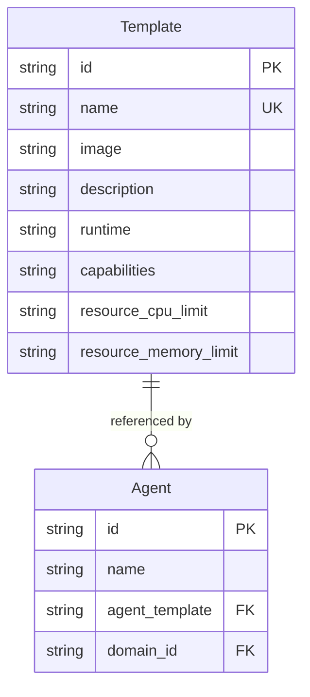

# feat: Agent Templates, Skill Registry, and Messaging/Social Integrations

## Overview

Support the two primary MOB use cases through purpose-built agent templates, a skill registry aligned with the AgentSkills.io standard, and platform integrations for messaging (WhatsApp, Telegram) and social media (LinkedIn, Instagram).

**Use Case 1 — Pydantic AI Social Agent:** Run pydantic-ai agents that communicate via WhatsApp and Telegram, and post on LinkedIn and Instagram.

**Use Case 2 — Pi/OpenClaw Coding Agent:** Run Pi or OpenClaw agents with a custom set of skills and CLI tools pre-installed.

## Problem Statement / Motivation

MOB can orchestrate pydantic-ai agents today, but:
- There is only one agent image (`mob-agent-pydantic:latest`) with no messaging or social integrations
- Skills exist in the database but are **never injected into running pods** — they are metadata-only
- `agent_template` is a free-form string with no validation, no registry, and no documented contract
- There is no way to discover available templates or know what tools each template supports
- The system cannot receive inbound messages from external platforms (no webhook ingress)

## Proposed Solution

### Architecture

```
┌─────────────────────────────────────────────────────────┐
│                    MOB Platform                          │
│                                                         │
│  Template Registry ─── Agent Templates (Docker images)  │
│       │                    │                            │
│       │              ┌─────┴──────────┐                 │
│       │              │                │                 │
│       │    mob-agent-pydantic   mob-agent-pi            │
│       │    mob-agent-social     mob-agent-openclaw      │
│       │                                                 │
│  Skill Registry ─── Skills (AgentSkills.io format)      │
│       │              mounted as ConfigMaps in pods      │
│       │                                                 │
│  Webhook Gateway ─── Routes inbound messages            │
│       │              from WhatsApp/Telegram to pods     │
│                                                         │
└─────────────────────────────────────────────────────────┘
```

### Three Pillars

1. **Agent Template System** — A registry of validated templates with documented contracts, tool declarations, and resource requirements
2. **Skill Registry** — Adopt AgentSkills.io standard; inject skills into pods via ConfigMaps
3. **Platform Integrations** — Messaging (WhatsApp, Telegram) and social (LinkedIn, Instagram) as template capabilities

---

## Phase 1: Agent Template Contract & Registry

### 1.1 Define the Agent Template Contract

Every agent template (Docker image) **must** implement:

| Requirement | Detail |
|---|---|
| `GET /health` on port 8081 | Returns `{"status": "ok", "state": "<state>"}` |
| `POST /message` on port 8081 | Accepts `{"message": "..."}`, returns `{"response": "...", "state": "..."}` |
| Pod annotation `mob.io/agent-state` | Self-report state: `idle`, `busy`, `finished`, `failed` |
| Env vars consumed | `SESSION_ID`, `AGENT_NAME`, `AGENT_SYSTEM_PROMPT`, `MODEL_ENDPOINT`, `AGENT_POD_NAME`, `AGENT_NAMESPACE` |
| SIGTERM handling | Graceful shutdown, set state to `finished` |

This contract already exists implicitly in `src/mob/agent/entrypoint.py:43-51` and `operator/src/resources/pod.rs:126-135`. It needs to be documented and enforced.

### 1.2 Template Registry Model

Add a `templates` table to track available agent templates:

```python
# src/mob/models/template.py
class Template(Base, TimestampMixin):
    __tablename__ = "templates"

    id: Mapped[str] = mapped_column(String(36), primary_key=True, default=generate_uuid)
    name: Mapped[str] = mapped_column(String(255), unique=True, nullable=False, index=True)
    image: Mapped[str] = mapped_column(String(500), nullable=False)  # Docker image ref
    description: Mapped[str | None] = mapped_column(Text, nullable=True)
    runtime: Mapped[str] = mapped_column(String(50), nullable=False)  # pydantic-ai, pi, openclaw
    capabilities: Mapped[str | None] = mapped_column(Text, nullable=True)  # JSON list of capability names
    resource_cpu_limit: Mapped[str | None] = mapped_column(String(20), nullable=True)  # e.g. "2000m"
    resource_memory_limit: Mapped[str | None] = mapped_column(String(20), nullable=True)  # e.g. "2Gi"
```

The `capabilities` field is a JSON list of strings (e.g., `["whatsapp", "telegram", "linkedin", "instagram"]`) declaring what the image supports. This enables validation: if an agent's `custom_config` enables WhatsApp but the template doesn't declare that capability, the API rejects the request.

### 1.3 CLI Commands

```bash
mob template list                          # list available templates
mob template show <name>                   # show template details + capabilities
mob template create --name X --image Y --runtime Z --capabilities "a,b"
mob template delete <name>
```

### 1.4 Validate agent_template on Agent Create/Update

When creating or updating an agent, resolve `agent_template` against the template registry:
- If it matches a registered template name, use the template's image
- If it looks like a Docker image reference (contains `:` or `/`), allow it as-is (backward compatible)
- Warn if no matching template is found

### 1.5 Resource Overrides from Templates

Update the Session CRD and operator pod builder to accept optional resource limits from the template. Pi/OpenClaw images with Node.js runtimes may need more than the current 256Mi-1Gi memory limit.

Add `resource_cpu_limit` and `resource_memory_limit` to `SessionSpec` in `operator/src/crd/session.rs`. The Python API populates these from the template registry when creating a Session CR.



---

## Phase 2: Skill Registry (AgentSkills.io Standard)

### 2.1 Align Skill Model with AgentSkills.io

The [AgentSkills.io specification](https://agentskills.io/specification) defines skills as directories with a `SKILL.md` file containing YAML frontmatter:

```yaml
---
name: pdf-processing            # required, 1-64 chars, lowercase + hyphens
description: Extract PDF text   # required, 1-1024 chars
license: Apache-2.0             # optional
compatibility: Requires uv      # optional, 1-500 chars
metadata:                       # optional, key-value pairs
  author: example-org
  version: "1.0"
allowed-tools: Bash(git:*) Read # optional, space-delimited
---

# Instructions (markdown body)
...
```

**Current Skill model** (`src/mob/models/skill.py`):
- `name` (String 255) — maps to AgentSkills `name`
- `description` (Text) — maps to AgentSkills `description`
- `skills_md` (Text) — stores the **full SKILL.md content** (frontmatter + body)
- `references_path` (String 500) — intended for reference files, undefined semantic

**Changes needed:**

```python
# src/mob/models/skill.py — updated
class Skill(Base, TimestampMixin):
    __tablename__ = "skills"

    id: Mapped[str] = mapped_column(String(36), primary_key=True, default=generate_uuid)
    name: Mapped[str] = mapped_column(String(64), unique=True, nullable=False, index=True)
    description: Mapped[str] = mapped_column(String(1024), nullable=False)
    skill_md: Mapped[str | None] = mapped_column(Text, nullable=True)  # full SKILL.md body (markdown instructions)
    license: Mapped[str | None] = mapped_column(String(255), nullable=True)
    compatibility: Mapped[str | None] = mapped_column(String(500), nullable=True)
    metadata_json: Mapped[str | None] = mapped_column(Text, nullable=True)  # JSON key-value
    allowed_tools: Mapped[str | None] = mapped_column(String(500), nullable=True)  # space-delimited
```

Rename `skills_md` → `skill_md` (singular, stores the markdown body only). Drop `references_path` — references will be handled via the skill directory structure in ConfigMaps.

### 2.2 Skill Import from SKILL.md Files

Add a CLI command to import skills from AgentSkills.io-format directories:

```bash
mob skill import ./my-skill/                # imports from SKILL.md in directory
mob skill import ./my-skill/SKILL.md        # imports from file directly
```

The import command:
1. Reads `SKILL.md`, parses YAML frontmatter
2. Creates or updates the skill in the database
3. If the directory contains `scripts/`, `references/`, `assets/` — store their content (Phase 2.4)

### 2.3 Skill Injection into Agent Pods

**Mechanism:** ConfigMap volumes.

When the Python API creates a Session CR, it:
1. Looks up the agent's associated skills (via `AgentSkill` join table)
2. Creates a ConfigMap named `mob-skills-{session-name}` containing each skill's `SKILL.md` content
3. Passes the ConfigMap name in the Session CR spec

The operator mounts the ConfigMap as a volume at `/skills/` in the pod:

```
/skills/
├── code-review/
│   └── SKILL.md
├── data-analysis/
│   └── SKILL.md
```

**Changes required:**

1. **Session CRD** (`operator/src/crd/session.rs`): Add `skills_configmap: Option<String>` to `SessionSpec`
2. **Pod builder** (`operator/src/resources/pod.rs`): If `skills_configmap` is set, mount it as a volume
3. **Python API** (`src/mob/services/sessions.py`): Create ConfigMap before creating Session CR
4. **Agent entrypoint** (`src/mob/agent/entrypoint.py`): Read skills from `/skills/` and include them in the system prompt or as tool definitions

### 2.4 Skill File Storage (Future)

For skills with `scripts/`, `references/`, and `assets/` directories, use a multi-key ConfigMap or a PersistentVolume. This is deferred to a later phase — Phase 2.3 handles the core `SKILL.md` content which is sufficient for instructions-based skills.

### 2.5 YAML Agent Definition with Skills

The existing YAML loader already supports `skills: [name1, name2]`. No changes needed — skills are resolved by name to UUIDs by the CLI resolver (`src/mob/cli/resolver.py`).

---

## Phase 3: Agent Template Images

### 3.1 Template: `mob-agent-pydantic` (Base)

The existing `Dockerfile.agent` — no changes needed. This is the base pydantic-ai agent.

**Capabilities:** None (base LLM interaction only)

### 3.2 Template: `mob-agent-social`

Extended pydantic-ai image with messaging and social media SDKs pre-installed.

```dockerfile
# Dockerfile.agent-social
FROM mob-agent-pydantic:latest

# Messaging
RUN pip install pywa aiogram

# Social media
RUN pip install requests-oauthlib

# Copy integration modules
COPY src/mob/agent/integrations/ /app/src/mob/agent/integrations/
```

**Capabilities:** `whatsapp`, `telegram`, `linkedin`, `instagram`

**Tool enable/disable via configuration:**

The agent entrypoint reads `AGENT_CUSTOM_*` env vars to decide which integrations to initialize:

```yaml
# agent.yaml
custom:
  whatsapp_enabled: "true"
  whatsapp_phone_number_id: "123456789"
  telegram_enabled: "true"
  telegram_bot_token: ""  # provided at runtime via --env
  linkedin_enabled: "false"
  instagram_enabled: "false"
```

Each integration module registers itself as a pydantic-ai tool only when its `_enabled` flag is `"true"`:

```python
# src/mob/agent/integrations/whatsapp.py
def register_whatsapp_tools(agent: Agent) -> None:
    """Register WhatsApp tools with the pydantic-ai agent."""

    @agent.tool
    async def send_whatsapp_message(ctx, phone_number: str, message: str) -> str:
        """Send a WhatsApp message to a phone number."""
        ...

    @agent.tool
    async def reply_whatsapp(ctx, message: str) -> str:
        """Reply to the current WhatsApp conversation."""
        ...
```

### 3.3 Template: `mob-agent-pi`

Pi coding agent runtime. Uses the Pi TypeScript toolkit as the agent runtime instead of pydantic-ai.

```dockerfile
# Dockerfile.agent-pi
FROM node:22-slim

RUN npm install -g @mariozechner/pi-coding-agent

# MOB adapter: HTTP wrapper that translates /health and /message to Pi's interface
COPY src/mob/agent/adapters/pi_adapter.py /app/adapter.py

EXPOSE 8081
ENTRYPOINT ["python", "/app/adapter.py"]
```

The adapter is a thin Python/FastAPI server that:
- Exposes the MOB agent contract (`GET /health`, `POST /message` on 8081)
- Translates messages to/from the Pi agent's SDK interface
- Reports state via K8s pod annotations

**Capabilities:** `coding`, `shell`, `browser` (depends on Pi's built-in tools)

### 3.4 Template: `mob-agent-openclaw`

OpenClaw personal AI assistant runtime.

```dockerfile
# Dockerfile.agent-openclaw
FROM python:3.11-slim

RUN pip install openclaw

# MOB adapter
COPY src/mob/agent/adapters/openclaw_adapter.py /app/adapter.py

EXPOSE 8081
ENTRYPOINT ["python", "/app/adapter.py"]
```

**Capabilities:** `coding`, `shell`, `browser`, `skills` (OpenClaw's native skill system)

> **Note:** OpenClaw and Pi both support the AgentSkills.io standard natively. Skills injected via ConfigMaps at `/skills/` can be discovered by these runtimes if the adapter sets the skill directory path.

### 3.5 Makefile Targets

```makefile
SOCIAL_IMAGE := mob-agent-social
PI_IMAGE := mob-agent-pi
OPENCLAW_IMAGE := mob-agent-openclaw

build-agent-social:
	docker build -t $(SOCIAL_IMAGE):$(AGENT_TAG) -f Dockerfile.agent-social .

build-agent-pi:
	docker build -t $(PI_IMAGE):$(AGENT_TAG) -f Dockerfile.agent-pi .

build-agent-openclaw:
	docker build -t $(OPENCLAW_IMAGE):$(AGENT_TAG) -f Dockerfile.agent-openclaw .

local-rebuild-agent-social: build-agent-social
	kind load docker-image $(SOCIAL_IMAGE):$(AGENT_TAG) --name $(KIND_CLUSTER)

local-rebuild-agent-pi: build-agent-pi
	kind load docker-image $(PI_IMAGE):$(AGENT_TAG) --name $(KIND_CLUSTER)

local-rebuild-agent-openclaw: build-agent-openclaw
	kind load docker-image $(OPENCLAW_IMAGE):$(AGENT_TAG) --name $(KIND_CLUSTER)
```

---

## Phase 4: Messaging Integrations (WhatsApp + Telegram)

### 4.1 Webhook Gateway

A shared service that receives inbound webhooks from external platforms and routes them to the correct agent pod.

```
External Platform → Webhook Gateway (mob-webhook:8082) → Agent Pod (:8081/message)
```

**Implementation:** A new FastAPI service (`src/mob/webhook/gateway.py`) deployed as a Kubernetes Deployment + Service + Ingress.

**Routing:** Webhook URLs include the session ID:
- WhatsApp: `https://<domain>/webhooks/whatsapp/{session-id}`
- Telegram: `https://<domain>/webhooks/telegram/{session-id}`

The gateway:
1. Receives the platform-specific webhook payload
2. Extracts the session ID from the URL path
3. Looks up the agent pod IP via the K8s API (same pattern as `sessions.py:send_message`)
4. Translates the platform message format to MOB's `{"message": "..."}` format
5. Forwards to the agent pod's `/message` endpoint
6. Translates the agent's response back to the platform format and sends it via the platform API

### 4.2 WhatsApp Integration

**SDK:** [PyWa](https://pywa.readthedocs.io/) — production-ready Python library for WhatsApp Business Cloud API.

**Requirements:**
- Meta Business Account + WhatsApp Business API access
- Phone number registered in WhatsApp Business
- Webhook verification token

**Credentials (env vars):**
- `WHATSAPP_PHONE_NUMBER_ID` — from Meta Business dashboard
- `WHATSAPP_ACCESS_TOKEN` — long-lived token from Meta
- `WHATSAPP_VERIFY_TOKEN` — for webhook verification
- `WHATSAPP_APP_SECRET` — for payload signature verification

**Key constraint:** Meta's webhook requires HTTP 200 response within 20 seconds. The gateway must respond immediately and process asynchronously.

### 4.3 Telegram Integration

**SDK:** [aiogram 3.x](https://docs.aiogram.dev/) — async Telegram Bot API framework.

**Requirements:**
- Bot token from @BotFather
- Webhook URL set via `setWebhook` API

**Credentials (env vars):**
- `TELEGRAM_BOT_TOKEN`
- `TELEGRAM_WEBHOOK_SECRET` — for verifying inbound requests

**Advantage:** Telegram is the simplest integration — a single bot token is all that's needed. No OAuth flow, no approval process.

### 4.4 Credential Storage

**Per-agent secrets** instead of the shared `mob-agent-secrets`:

1. The API creates a K8s Secret named `mob-agent-{agent-name}-secrets` when platform credentials are provided
2. The Session CR spec includes `agent_secret_name: Option<String>`
3. The operator mounts only that secret into the pod via `envFrom`

This follows least-privilege: each agent pod only receives its own credentials.

For the webhook gateway, platform credentials are stored in the agent's `env_defaults` (encrypted at rest in the DB) and passed to the gateway when routing.

---

## Phase 5: Social Media Integrations (LinkedIn + Instagram)

### 5.1 LinkedIn Posting

**API:** [LinkedIn Marketing API](https://learn.microsoft.com/en-us/linkedin/marketing/) — `ugcPosts` endpoint.

**Requirements:**
- LinkedIn Developer App with `w_member_social` permission
- OAuth 2.0 access token (60-day expiry, requires refresh)

**Credentials:**
- `LINKEDIN_ACCESS_TOKEN`
- `LINKEDIN_PERSON_URN` — the user's LinkedIn URN (e.g., `urn:li:person:ABC123`)

**Agent tool:**

```python
@agent.tool
async def post_to_linkedin(ctx, text: str, image_url: str | None = None) -> str:
    """Publish a post on LinkedIn."""
    ...
```

### 5.2 Instagram Publishing

**API:** [Instagram Graph API](https://developers.facebook.com/docs/instagram-platform/instagram-graph-api) — media container flow.

**Requirements:**
- Facebook Business Account linked to Instagram Professional Account
- App review for `instagram_content_publish` permission

**Credentials:**
- `INSTAGRAM_ACCESS_TOKEN` — long-lived token (60-day expiry)
- `INSTAGRAM_BUSINESS_ACCOUNT_ID`

**Agent tool:**

```python
@agent.tool
async def post_to_instagram(ctx, image_url: str, caption: str) -> str:
    """Publish a photo post on Instagram."""
    # Step 1: Create media container
    # Step 2: Poll for completion
    # Step 3: Publish
    ...
```

**Note:** Instagram requires a publicly accessible image URL. The agent must either receive one or upload the image to a temporary hosting service first.

### 5.3 Token Refresh

LinkedIn and Instagram tokens expire after ~60 days. Options:
1. **Manual:** User provides new tokens via `mob agent edit` or `env_defaults`
2. **Automatic (future):** A token refresh service that stores refresh tokens and rotates access tokens before expiry

Phase 5 starts with manual token management. Automatic refresh is a future enhancement.

---

## Technical Considerations

### Architecture Impacts

- **New K8s resource:** ConfigMap per session (for skills)
- **New service:** Webhook gateway (Deployment + Service + Ingress)
- **New CRD fields:** `skills_configmap`, `agent_secret_name`, `resource_cpu_limit`, `resource_memory_limit`
- **New DB table:** `templates`
- **Modified DB table:** `skills` (column renames and additions)

### Performance

- ConfigMap creation adds ~100ms to session startup (K8s API call)
- Webhook gateway adds one network hop (~5ms) to inbound messages
- Pod resource limits should be configurable per template (Pi/OpenClaw need more memory)

### Security

- Per-agent secrets prevent credential leakage between agents
- Webhook gateway validates platform signatures (WhatsApp `X-Hub-Signature`, Telegram `X-Telegram-Bot-Api-Secret-Token`)
- OAuth tokens stored in K8s Secrets (encrypted at rest with K8s encryption config)
- Gateway rejects webhooks for non-existent or stopped sessions

## System-Wide Impact

### Interaction Graph

- `mob agent create` → validates template exists in registry → creates agent
- `mob session create` → creates skills ConfigMap → creates agent secret → creates Session CR → operator creates pod with ConfigMap volume + secret mount
- Webhook received → gateway routes to pod → pod processes → gateway sends platform response
- `mob skill import` → parses SKILL.md → creates/updates skill in DB

### Error Propagation

- Template not found → API returns 400 at agent creation time (not at pod spawn time)
- Skill ConfigMap creation fails → Session creation fails (no orphaned CRs)
- Webhook gateway can't reach pod → returns 502 to platform → platform retries
- Platform API rate limit → agent tool returns error → LLM can decide to retry or inform user

### State Lifecycle Risks

- **Orphaned ConfigMaps:** Session cleanup must delete the skills ConfigMap. Add to operator finalizer.
- **Orphaned Secrets:** Per-agent secrets persist across sessions (intentional — they're agent-level, not session-level)
- **Stale webhook registrations:** If a session ends but the platform still sends webhooks, the gateway returns 404. Platforms handle this gracefully (WhatsApp retries then stops, Telegram drops silently).

### API Surface Parity

| CLI Command | API Endpoint | Notes |
|---|---|---|
| `mob template list` | `GET /api/v1/templates` | New |
| `mob template create` | `POST /api/v1/templates` | New |
| `mob template show` | `GET /api/v1/templates/{id}` | New |
| `mob template delete` | `DELETE /api/v1/templates/{id}` | New |
| `mob skill import` | `POST /api/v1/skills/import` | New (accepts SKILL.md content) |

### Integration Test Scenarios

1. Create a template → create an agent referencing it → start a session → verify pod uses the template's image and resource limits
2. Import a skill → attach to agent → start session → verify `/skills/` directory exists in pod with correct content
3. Start a session with Telegram enabled → send a simulated Telegram webhook → verify message reaches agent and response is returned
4. Create an agent with an invalid template name → verify API rejects with helpful error
5. Stop a session → verify skills ConfigMap is cleaned up by the operator

## Acceptance Criteria

### Phase 1: Template Registry
- [ ] `templates` table exists with CRUD API and CLI commands
- [ ] `mob template list` shows available templates
- [ ] Agent creation validates `agent_template` against registry (with backward-compatible fallback)
- [ ] Template contract is documented in `docs/agent-template-contract.md`
- [ ] Resource limits from templates are passed through to pods

### Phase 2: Skill Registry
- [ ] Skill model aligned with AgentSkills.io (name constraints, new fields)
- [ ] `mob skill import ./path/` parses SKILL.md and creates skill
- [ ] Skills are injected into pods via ConfigMaps at `/skills/`
- [ ] Agent entrypoint reads skills from `/skills/` and incorporates them
- [ ] Session cleanup deletes skills ConfigMap

### Phase 3: Template Images
- [ ] `Dockerfile.agent-social` builds and runs successfully
- [ ] `Dockerfile.agent-pi` builds with MOB adapter, passes health check
- [ ] `Dockerfile.agent-openclaw` builds with MOB adapter, passes health check
- [ ] Makefile targets for all template images
- [ ] Templates seeded in registry via `mob template create` or migration

### Phase 4: Messaging
- [ ] Webhook gateway deployed as K8s service
- [ ] WhatsApp webhooks received and routed to agent pods
- [ ] Telegram webhooks received and routed to agent pods
- [ ] Per-agent secrets created and mounted correctly
- [ ] Webhook signature verification for both platforms

### Phase 5: Social Media
- [ ] `post_to_linkedin` tool available in social template
- [ ] `post_to_instagram` tool available in social template
- [ ] Token management via env vars
- [ ] Error handling for rate limits and expired tokens

## Dependencies & Risks

| Risk | Impact | Mitigation |
|---|---|---|
| Meta WhatsApp API approval delay | Blocks WhatsApp integration | Start with Telegram (no approval needed) |
| LinkedIn Partner Program requirement | May block programmatic posting | Use Community Management API or unofficial library as fallback |
| Instagram requires public image URLs | Complicates image posting flow | Use pre-signed S3 URLs or image proxy |
| Pi/OpenClaw APIs may change | Adapter breaks | Pin versions in Dockerfile, adapter is thin |
| ConfigMap size limit (1MB) | Large skill sets may not fit | Split into multiple ConfigMaps or use PV for large skills |
| OAuth token expiry (60 days) | Social posting silently fails | Log warnings, add monitoring, plan auto-refresh |

## Example YAML Templates

### Pydantic AI Social Agent

```yaml
# examples/social-agent.yaml
name: social-bot
agent_template: mob-agent-social
domain: production
system_prompt: |
  You are a social media assistant.
  You can send messages via WhatsApp and Telegram,
  and post content on LinkedIn and Instagram.
model_endpoint: "anthropic:claude-sonnet-4-6-20260320"
skills:
  - social-media-guidelines
  - brand-voice
env:
  ANTHROPIC_API_KEY: ""
  WHATSAPP_ACCESS_TOKEN: ""
  WHATSAPP_PHONE_NUMBER_ID: "123456789"
  TELEGRAM_BOT_TOKEN: ""
  LINKEDIN_ACCESS_TOKEN: ""
  INSTAGRAM_ACCESS_TOKEN: ""
  INSTAGRAM_BUSINESS_ACCOUNT_ID: ""
custom:
  whatsapp_enabled: "true"
  telegram_enabled: "true"
  linkedin_enabled: "true"
  instagram_enabled: "false"
```

### Pi Coding Agent

```yaml
# examples/pi-agent.yaml
name: code-assistant
agent_template: mob-agent-pi
domain: dev
system_prompt: |
  You are a coding assistant with access to shell tools.
model_endpoint: "anthropic:claude-sonnet-4-6-20260320"
skills:
  - code-review
  - test-runner
env:
  ANTHROPIC_API_KEY: ""
custom:
  pi_mode: "interactive"
```

## Implementation Order

1. **Phase 1** (Template Registry) — foundation, no external dependencies
2. **Phase 2** (Skill Registry) — builds on Phase 1, enables skills for all templates
3. **Phase 3** (Template Images) — builds on Phase 1+2, creates the actual images
4. **Phase 4** (Messaging) — start with Telegram (simplest), then WhatsApp
5. **Phase 5** (Social Media) — LinkedIn first (simpler API), then Instagram

**Recommended first milestone:** Phases 1+2+3 together — this delivers the template system, skill injection, and all four images without any external API dependencies.

## Sources & References

### Internal References
- Agent model: `src/mob/models/agent.py:9-32`
- Skill model: `src/mob/models/skill.py:9-19`
- YAML loader: `src/mob/cli/yaml_loader.py:7-17`
- Agent entrypoint: `src/mob/agent/entrypoint.py:43-51`
- Pod builder: `operator/src/resources/pod.rs:19-155`
- Session CRD: `operator/src/crd/session.rs`
- Existing solution: `docs/solutions/integration-issues/pydantic-ai-agent-image-k8s-orchestration.md`
- Ideation: `docs/ideation/2026-03-23-open-ideation.md` (Ideas #5 and #7)

### External References
- AgentSkills.io Specification: https://agentskills.io/specification
- AgentSkills.io Overview: https://agentskills.io/home
- Pi Mono (coding agent toolkit): https://github.com/badlogic/pi-mono
- OpenClaw: https://github.com/openclaw/openclaw
- PyWa (WhatsApp Python SDK): https://pywa.readthedocs.io/
- aiogram (Telegram Bot Framework): https://docs.aiogram.dev/
- WhatsApp Business Cloud API: https://developers.facebook.com/docs/whatsapp/cloud-api
- Instagram Graph API: https://developers.facebook.com/docs/instagram-platform/instagram-graph-api
- LinkedIn Marketing API: https://learn.microsoft.com/en-us/linkedin/marketing/
